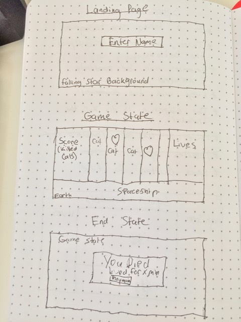
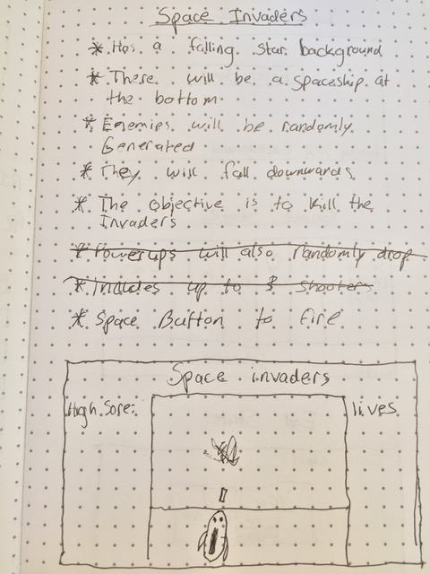
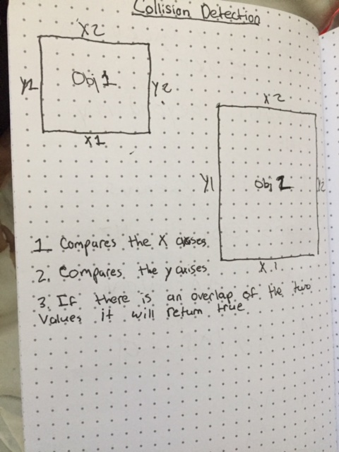
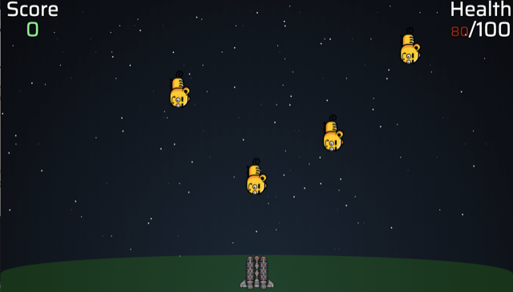

# Alien space cat invasion!
Advanced alien cats from another planet are attacking Earth. The earth has called on all the world best fighter pilots new and retired to kill off these invading pest using specially prepared anti-cat projectiles. It is up to you to save the world!

# Wireframes
Picture of basic wireframes for stages of the game. The actual product is different than what was first envisioned after much thought.



# Initial features list
Picture of the first list of features that would be included in the game. Some were added and some were removed.



# Challenges
Throughout this project, I was constantly faced with new Challenges. I had the most trouble getting the collision detection algorithm to work. 

```javascript
// Found on MDN
// https://developer.mozilla.org/en-US/docs/Games/Techniques/2D_collision_detection
var rect1 = {x: 5, y: 5, width: 50, height: 50}
var rect2 = {x: 20, y: 10, width: 10, height: 10}

if (rect1.x < rect2.x + rect2.width &&
   rect1.x + rect1.width > rect2.x &&
   rect1.y < rect2.y + rect2.height &&
   rect1.height + rect1.y > rect2.y) {
    // collision detected!
}
```
It seems like a fairly simple algorithm since its no more than 8 lines, but configuring it to work with the game was fairly difficult. I drew some algorithims and tried to go step by step in order to figure out what the algorithm was doing and I eventually solved it. 



Now that I had got the collision detection to work, I needed to figure out a way to check whether ALL of the objects were ever colliding. I got this to work by pushing every bullet and cat to their own respective arrays and then comparing the two arrays to see whether any collisions occured. If a collision occured the both the cat and bullet would be removed and the score would be incremented.

My final collision detection algorithim looked like this:
```javascript
function collisionDetection() {
    bullets.forEach((bullet, b) => {
      if (b === 0) {
        nul = null;
      } else {
        cats.forEach((cat, c) => {
          if (c === 0) {
            nul = null;
          } else {
            const bulletX = bullet.getPosition().x;
            const bulletY = bullet.getPosition().y;
            const catX = cat.getPosition().x;
            const catY = cat.getPosition().y;
            if (bulletX < catX + 100 &&
                bulletX + 15 > catX &&
                bulletY < catY + 59 &&
                30 + bulletY > catY) {
              bullet.removeBullet();
              bullets.splice(b, 1);
              cat.removeCat();
              cats.splice(c, 1);
              $('#scores').html($('#scores').html() - (-5));
            }
          }
        });
      }
    });
  }
```

Now that I had got the collision detection to work, I needed to figure out a way to check whether ALL of the objects were ever colliding. I got this to work by pushing every bullet and cat to their own respective arrays and then comparing the two arrays to see whether any collisions occured.
# Screenshots
Pictures from the games


